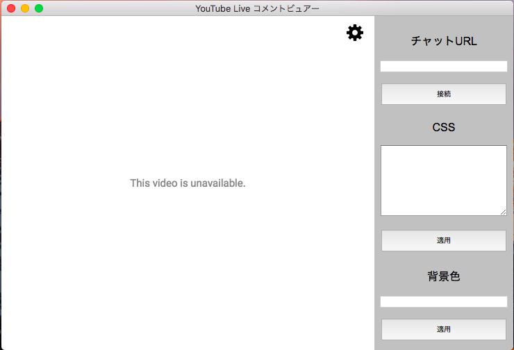

# YLCV 

# 概要
「YLCV」はYoutube Live専用コメントビュアーです。  
WebViewにより、直接Youtubeのコメントページを表示しているため、リアルタイムでコメントを取得できます。  
また、CSSによって自由にコメントの表示を変えることができます。  

# ダウンロード
  - [GitHub - Releases](https://github.com/minakawa-daiki/YLCV/releases/tag/v0.1.0)

# 使い方

  - 設定画面の開き方
    アプリケーションにマウスカーソルを乗っけると右上に歯車アイコンが出るのでそこをクリックしてください。

  - チャットに接続  
    「https://www.youtube.com/live_chat?v=???」の形式で入力してください。
    
  - CSSの変更  
    「[https://chatv2.septapus.com](https://chatv2.septapus.com)」を利用するとCSSを簡単に変更できます。
    
  - 背景色の変更
    このアプリ自体の背景色を変更します。

# 記事
  - はてなブログ -  
  - Qiita - 

# OS
  - OSX
  - Windows
  - Linux

# Author
[Oliver](https://minakawadaiki.com)

# Licence
[MIT](./LICENSE)

